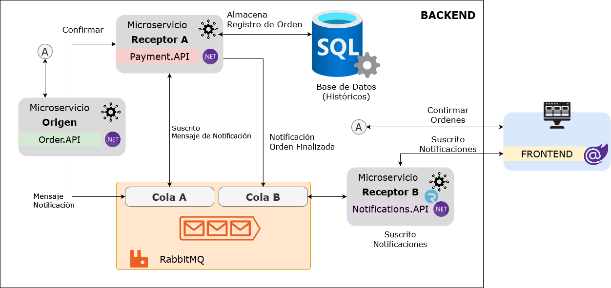

# Order System Demo

Es un conjunto de microservicios que emulan un sistema de ordenes y envío de notificaciones entre Backend y Frontend. Implementa componentes de Logging distribuido y gestor de colas por medio de Rabbit MQ

## **Conocimientos previos**  
* C#
* Conocimientos básicos de programación orientada a objetos
* Conocimientos básicos de Docker

# Arquitectura

